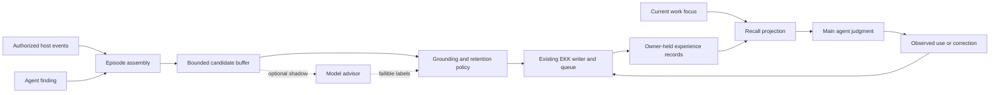

# Design: acquiring, recalling and revising experience

Normative outcomes are in [spec.md](spec.md). Interfaces below are proposed
contracts for implementation; they are not existing CLI commands or APIs.

## Architecture

Host adapters own acquisition and optional inference. Pure application code owns
the episode/experience contracts and projections. MLX, processes, host logs,
filesystem paths, scheduling and model weights remain adapters. Existing EKK
authorization and writers retain their responsibilities.

The observer needs two inputs: the present episode and a bounded picture of the
current work/related known findings. It cannot classify a duplicate without
receiving the candidate it might duplicate. It cannot discover an unrecorded
thought, source or world state merely by adding a schema field.

## Representation and storage

Use three distinct representations, not three canonical databases:

| Representation | Minimum content | Owner/lifetime |
| --- | --- | --- |
| Episode envelope | Stable host/event identity, task/work reference when available, timestamps, target/version, permitted evidence selectors/digests, coverage and a bounded description of attempt/result | Host-owned original; short-lived observer projection |
| Candidate | Stable logical key, proposed statement, acquisition mode, grounds, relevance cue, unknowns and proposed disposition | Private bounded operational buffer; configurable expiry/capacity |
| Durable experience | Versioned statement with grounds, object/applicability, episode identity and correction relationships | Existing owner-held canonical records |

Episode identity is distinct from a work item. Several attempts may be one
episode; a task may contain several episodes. Segmentation should preserve a
meaningful attempt/obstacle/change/result when observable, without requiring all
four in every case. Capture both unexpected friction and positive findings.

Candidate dispositions are `transient`, `candidate_experience`,
`possible_duplicate`, `ordinary_noise`, and `insufficient_context`. They are
selection advice, not truth statuses. `possible_duplicate` must reference the
supplied comparison item; disagreement can remain unresolved.

Keep semantic dimensions separate:

- acquisition: observed, inferred or assumed; forecasts are explicitly marked;
- evidential support: source-linked, partial, unavailable or challenged;
- applicability: matching, uncertain, changed or no longer applicable;
- use outcome: considered, used, rejected, helpful, unhelpful or unknown;
- governance/adoption: the existing EKK contract, unchanged.

A model's number does not replace these dimensions. Do not demand numerical
confidence from a person or fabricate calibrated probabilities.

Preserve `ekk.record/0.1`. Prefer an additive, versioned `experience` annotation
on ordinary `observation`/`claim`/`note` records with a human-readable body. Choose
the concrete profile in T02 and test old-reader behavior. Do not overload the
existing `observation.subject/aspects/observed_at` fields: those already opt into
the declared observation-gap contract. New material is optional, non-governing
data unless separately adopted through existing governance.

Work association is navigation. Exact evidence is a strong basis only where the
claim actually depends on it. Do not make all work events a growing transitive
dependency closure. Recall must not be limited to the work view's most recent
64 event links; find permitted historical evidence by stable identity/index.

Do not store complete transcripts. A permitted minimal source excerpt can be
captured through an existing source mechanism when stable evidence is needed.
Otherwise use an authorized locator plus version/digest and explicitly handle
later unavailability. A private path is not a portable public source reference.

## Ports and integration surfaces

Proposed logical operations:

| Operation | Contract |
| --- | --- |
| `capture_episode` | Accept bounded host evidence and return a durable local receipt or an explicit bounded rejection; no model wait |
| `propose_finding` | Add an agent-authored candidate with grounds; optional, never required after each task |
| `advise_candidate` | Return model identity, version, typed labels and raw scores for supplied candidates; initially shadow-only |
| `retain_experience` | Publish an exact candidate through current owner permissions and the existing durable writer/queue |
| `recall_experience` | Project authorized applicable cards for the current focus with coverage/deadline/budget information |
| `revise_experience` | Challenge, correct or retire an exact revision through conditional writes |
| `record_use` | Record a justified selected use/rejection/outcome when useful; never synthesize benefit from delivery |

These may extend current commands/tools; do not create one tool per internal
step merely to mirror this table. CLI/Gateway changes should reuse work/search/
retain/improve routes when that preserves their meaning.

T01 must inspect the actual host's supported event and focus-change interfaces.
Prefer an existing supported integration over a polling service. If only logs
are available, label replay/latency accurately; determine whether their events
arrive during execution and whether there is a supported delivery channel back
to the active agent. A background log reader with no recall delivery is not the
complete product. Do not claim live capability from a timer or MCP tool listing.

Manual finding capture remains a useful fallback, but cannot by itself satisfy
the passive acquisition and timely-recall scope. If the host cannot support it,
record the blocking capability and revise the release decision explicitly.

## Foreground cost and candidate processing

Keep local capture admission bounded and cheap. Asynchronous extraction,
classification and consolidation have explicit per-owner budgets, concurrency
limits, capacity/expiry rules and cancellation. Before implementation activation,
T01 records proposed defaults and measurements on the actual host; no numeric
performance claim is established by this plan.

Defaults must impose finite bounds on event bytes, candidate count/age/bytes,
inference input/output, background work and optional recall size/wait. Laya input
uses the tokenizer and checkpoint budget, not character-count approximations.
If the meaningful episode does not fit, return `insufficient_context` or use the
ordinary path; do not silently remove counterevidence to obtain a label.

Backpressure leaves ordinary work available. Expose aggregate overflow/expiry
and source coverage in diagnostics, with bounded sampling for investigating
misses; do not produce a user notification or canonical record per dropped item.
Operational raw snippets expire independently of durable retained evidence.

## Recall and critical use

Compose recall from current task intention, object/entity/path anchors, declared
future cues and relevant aliases. Start with exact and lexical selection; a
semantic adapter can supplement authorized candidates later. Owner filtering
precedes model input. Initial Laya advice never reorders, suppresses or expands
the baseline.

Each card includes an exact reference, concise statement, reason for appearing
now, acquisition/uncertainty, target/applicability and available grounds.
Mandatory restrictions have a separate budget/precedence; optional experience
cannot hide them. Empty results are valid. Dedupe delivery by finding revision
and meaningful focus, allowing reappearance after a relevant change.

The agent checks the source as needed for the consequence of its decision. A
low-consequence reminder does not require a full archive read. Material action
still needs current domain evidence and authority. Findings never become system
instructions through retrieval, summaries or model judgments.

## Correction and recovery

Challenge preserves the disputed exact version. Correction creates a revision;
retirement removes active recommendation, not history. Derived summaries/indexes
are rebuildable and cannot revive a retired statement. Strongly dependent claims
are marked for reconsideration; merely related valid work is preserved.

| Situation | Required behavior |
| --- | --- |
| Same event after restart | Same logical candidate key; one publication outcome |
| Lost publication response | Reconcile/retry the same frozen request/key using the existing queue |
| Concurrent edits | Conditional revision conflict; read and reconsider, never overwrite silently |
| Advisor timeout or malformed output | Mark advice unavailable and preserve ordinary work/recall |
| Evidence inaccessible or revoked | Exclude forbidden bytes, report unavailable support, propagate restrictions to derived disclosure |
| Renamed/refactored target | Use explicit identity/alias/condition evidence; no universal invalidation on every commit |
| Candidate overflow or expiry | Bounded operational loss accounting; no claim of full observation coverage |
| Disable/rollback | Stop observer/inference and new capture; canonical records remain readable; no destructive reverse migration |

Reuse the current private operational-store facilities where their lifecycle
fits. Keep observer state out of the strict diagnostic journal namespace, whose
reader has a different contract. State is isolated by owner, even when several
profiles share a permitted owner route.

## Laya and training boundary

The existing [Laya advisory spec](../../plans/laya-advisory/spec.md) covers labels
on search candidates. Reuse its model-neutral failure/identity/recheck principles;
retention triage uses a different operation and rubric. Its completed T1 does
not mean this release's adapter or learning behavior is implemented.

Laya is a typed-decision encoder, not a generative observation author. Candidate
formulation uses existing agent capability or a separately configured extractor.
Account for that extractor's cost; fast classification alone does not make the
whole pipeline cheap. Baseline operation is available without Laya.

Training targets selection behavior and boundaries of generalization, not a
hidden factual copy of project history. Start with supervised classification and
separate held-out calibration if eligible data exists. Whether to update only a
head, encoder parameters or adapters depends on measured capacity and actual
custom-architecture support. This spec does not assume a generative MLX LoRA
tool can train Laya or that RL has a trustworthy reward here.

Dataset provenance, rights, related-episode grouping, language coverage and
teacher/reviewer status are explicit. A teacher label is fallible. Sample rejected
and ordinary episodes as well as retained ones. Keep whole tasks/derived lessons
on one side of a split, reserve later/project-held-out examples, and calibrate
separately from the final comparison. Publish no private dataset or derived
checkpoint by default.

Evaluate missed useful findings, unsupported generalizations, selection cost,
option-order/truncation sensitivity, language behavior and calibration against a
simple baseline and base model. Do not use the model's own selected positives as
the complete evaluation population. Thresholds for applied behavior require
explicit evidence and a recorded decision; shadow advice is the initial limit.
